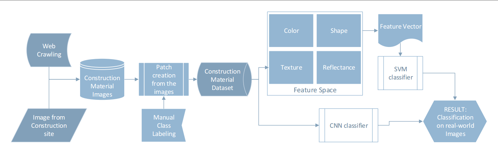
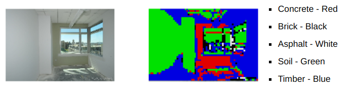

## Material recognition project

This is project for classifying construction materials based on the data collected from a construction site. The algorithm can be divided into follwing steps:
 * Segmenting a given image into patches
 * Texture features are extracted from these patches
 * Based on the feature extracted, classification is performed

The pictorial representation representation of the algorithm is shown in the figure below:

## Result

Below is example result produced by the model trained 
(left image= input, right image= output)

